# Claude Code AI Coding Workflow - Command-Based Steps

Based on Sabrina Ramonov's Ultimate AI Coding Guide, here's the complete workflow following her exact shortcut commands:

```mermaid
flowchart TD
    START[🚀 Open Claude Code] --> CLEAR[clear - Clear Context]
    CLEAR --> QNEW[qnew - Load Best Practices]
    QNEW --> DISCUSS[💬 Discuss User Story]
    DISCUSS --> QPLAN[qplan - Analyze Codebase]
    QPLAN --> QCODE[qcode - Implement & Test]
    QCODE --> QCHECK[qcheck - Review All Changes]
    QCHECK --> QCHECKF[qcheckf - Review Functions]
    QCHECKF --> QCHECKT[qcheckt - Review Tests]
    QCHECKT --> QUX[qux - Generate UX Tests]
    QUX --> QGIT[qgit - Commit & Push]
    QGIT --> COMPLETE[✅ Feature Complete]

    %% Command Details
    START --> START1["Open terminal or VSCode extension<br/>Enter normal mode initially<br/>Switch to auto-accept when coding"]
    
    CLEAR --> CLEAR1["/clear<br/>Clears conversation context<br/>Starts fresh session"]
    
    QNEW --> QNEW1["qnew<br/>Loads CLAUDE.md file<br/>Understands all best practices<br/>Sets coding standards"]
    
    DISCUSS --> DISCUSS1["Clarify requirements<br/>Simplify scope<br/>Remove unnecessary features<br/>Question sketchy approaches"]
    
    QPLAN --> QPLAN1["qplan<br/>Analyze similar codebase parts<br/>Check consistency with existing code<br/>Minimize changes required<br/>Identify reusable components"]
    
    QCODE --> QCODE1["qcode<br/>Follow TDD: write tests first<br/>Implement planned features<br/>Run prettier formatting<br/>Execute turbo typecheck lint"]
    
    QCHECK --> QCHECK1["qcheck<br/>Review ALL major code changes<br/>Apply Function Best Practices<br/>Apply Test Best Practices<br/>Apply Implementation Best Practices"]
    
    QCHECKF --> QCHECKF1["qcheckf<br/>Focus on functions added/edited<br/>Apply Function Best Practices checklist<br/>Ensure readability & testability"]
    
    QCHECKT --> QCHECKT1["qcheckt<br/>Focus on tests added/edited<br/>Apply Test Best Practices checklist<br/>Verify proper assertions"]
    
    QUX --> QUX1["qux<br/>Generate comprehensive test scenarios<br/>Sort by highest priority<br/>Think like human UX tester<br/>Test edge cases & user flows"]
    
    QGIT --> QGIT1["qgit<br/>Add all changes to staging<br/>Create conventional commit message<br/>Push to remote repository<br/>No Claude/Anthropic references"]
    
    COMPLETE --> COMPLETE1["Production-ready code<br/>All quality gates passed<br/>Tests verified<br/>Clean commit history"]

    %% Styling
    classDef setupCmd fill:#e1f5fe,stroke:#01579b,stroke-width:2px
    classDef planCmd fill:#f3e5f5,stroke:#4a148c,stroke-width:2px
    classDef codeCmd fill:#e8f5e8,stroke:#1b5e20,stroke-width:2px
    classDef reviewCmd fill:#fff3e0,stroke:#e65100,stroke-width:2px
    classDef testCmd fill:#fce4ec,stroke:#880e4f,stroke-width:2px
    classDef finalCmd fill:#e0f2f1,stroke:#004d40,stroke-width:2px

    class START,CLEAR,QNEW setupCmd
    class DISCUSS,QPLAN planCmd
    class QCODE codeCmd
    class QCHECK,QCHECKF,QCHECKT reviewCmd
    class QUX testCmd
    class QGIT,COMPLETE finalCmd
```

## Sabrina's Shortcut Commands Reference:

| Command | Full Purpose | When to Use |
|---------|-------------|-------------|
| `/clear` | Clear conversation context | Start of each new feature |
| `qnew` | Load CLAUDE.md best practices | After clearing, before any work |
| `qplan` | Analyze existing codebase patterns | Before implementation starts |
| `qcode` | Implement with TDD + quality gates | Main development phase |
| `qcheck` | Review all major code changes | After significant implementation |
| `qcheckf` | Review functions specifically | When functions added/modified |
| `qcheckt` | Review tests specifically | When tests added/modified |
| `qux` | Generate UX test scenarios | Before final validation |
| `qgit` | Commit with conventional format | Final step to save work |

## Key Workflow Insights:

1. **12 Total Steps** - One for each shortcut command plus discussion and completion
2. **Triple Review Process** - `qcheck` → `qcheckf` → `qcheckt` ensures quality
3. **TDD Enforced** - Tests written first in `qcode` step
4. **Codebase Consistency** - `qplan` analyzes existing patterns before coding
5. **UX Focus** - `qux` generates comprehensive user testing scenarios
6. **Clean Git History** - `qgit` enforces conventional commit standards

This command-driven approach transforms Claude Code from a simple AI assistant into a structured, quality-controlled development workflow that maintains production standards.