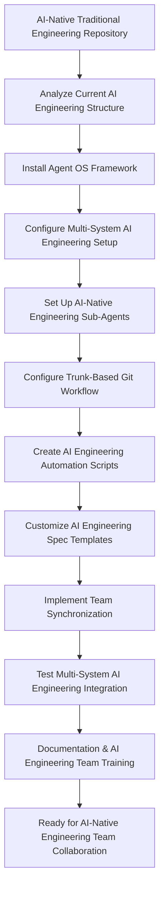

# Spec Requirements Document

> Spec: Agent OS Integration for AI-Native Traditional Engineering
> Created: 2025-07-31
> Status: Planning

## Executive Summary

**Prompt for Future Reuse:**
```
Set up buildermethods Agent OS (https://github.com/buildermethods/agent-os) for this AI-Native Traditional Engineering repository with comprehensive team collaboration features. Execute the following implementation with logical task dependency ordering:

TASK DEPENDENCY ORDERING STANDARD:
- All implementation tasks must follow logical dependency ordering where prior tasks are always applicable (if logical) to subsequent tasks
- Each task builds upon the achievements of previous tasks
- Task dependencies must be explicitly documented
- Foundation tasks (like system installation) come before dependent tasks (like analysis or configuration)
- This ordering minimizes errors, reduces rework, and ensures consistent implementation success across different team members and environments

IMPLEMENTATION STEPS:

1. INSTALL AGENT OS WITH MULTI-SYSTEM CONFIGURATION:
   Prerequisites: None - Foundation task
   - Install the framework at system level for Windows, Linux, macOS, or Unix
   - Configure system-level paths, environment variables, and shell integration
   - Set up cross-platform compatibility and OS-specific shell integration
   - Validate system installation with cross-platform compatibility tests

2. ANALYZE EXISTING AI-NATIVE ENGINEERING REPOSITORY:
   Depends on: Task 1 - System installation required to run @analyze-product
   - Run: @analyze-product "I want to install Agent OS in this AI-Native Traditional Engineering repository"
   - Document current structure, engineering patterns, and AI integration approaches
   - Identify integration points for the framework within AI-native engineering workflows
   - Create comprehensive analysis report for AI-native engineering integration

3. REPOSITORY INTEGRATION AND CONFIGURATION:
   Depends on: Task 2 - Analysis results guide repository configuration
   - Install and configure the framework in this repository based on analysis results
   - Create .agent-os directory structure optimized for AI-native engineering development
   - Configure repository-level settings for multi-system team synchronization
   - Always use /create-spec for specs and user stories

4. AI-NATIVE ENGINEERING SUB-AGENTS CONFIGURATION:
   Depends on: Task 3 - Repository structure and settings required for sub-agents
   - development-agent.md: AI-assisted engineering development workflows and patterns
   - testing-agent.md: AI-native testing and validation frameworks for engineering systems
   - deployment-agent.md: AI-integrated deployment and engineering system automation
   - Configure sub-agents for cross-system AI-native engineering synchronization

5. TRUNK-BASED GIT DEVELOPMENT WORKFLOW FOR AI-NATIVE ENGINEERING:
   Depends on: Task 4 - Sub-agents provide the automation foundation for git workflows
   - Configure trunk-based git development workflow for each AI-native engineering feature
   - Set up automated branching and merge workflows for AI-assisted engineering development
   - Implement feature flags for continuous AI-native engineering integration support

6. OS-SPECIFIC AI-NATIVE ENGINEERING AUTOMATION SCRIPTS:
   Depends on: Task 5 - Git workflow structure required before creating automation scripts
   - create-spec-branch.sh: Automated spec branch management for AI-native engineering features
   - sync-team-state.sh: Cross-system AI-native engineering environment synchronization
   - merge-spec-completion.sh: Automated spec completion workflows for AI-assisted engineering
   - Create OS-specific versions for Windows PowerShell, Linux/Unix bash, and macOS zsh/bash
   - ai-engineering-tasks.sh: AI-native engineering development task automation

7. ENHANCED SPEC TEMPLATES FOR AI-NATIVE ENGINEERING:
   Depends on: Task 6 - Automation scripts inform template workflow integration
   - Store all specs in .agent-os/specs/ folder with date-based naming
   - Include executive summary in every spec with original prompt and mermaid flowcharts
   - Modify spec templates for AI-native engineering development patterns and workflows
   - Ensure prompt completeness and self-containment for any AI-native engineering team

8. TEAM SYNCHRONIZATION FEATURES FOR AI-NATIVE ENGINEERING:
   Depends on: Task 7 - Templates and workflows must be established before team synchronization
   - Configure project-level and user-level settings for AI-native engineering environments
   - Implement cross-system state synchronization for AI-assisted engineering development
   - Enable consistent behavior across different AI-native engineering development environments
   - Support distributed team collaboration with trunk-based AI-native engineering development

9. TESTING AND VALIDATION FOR AI-NATIVE ENGINEERING:
   Depends on: Task 8 - All components must be implemented before comprehensive testing
   - Write comprehensive tests for system-level installation across all supported operating systems
   - Test OS-specific installation scenarios (Windows, Linux, macOS, Unix) with AI-native engineering tools
   - Test complete multi-system workflow from spec creation to AI-native engineering feature completion
   - Validate team synchronization and sub-agent functionality across different AI-native engineering environments

10. DOCUMENTATION AND TEAM TRAINING FOR AI-NATIVE ENGINEERING:
    Depends on: Task 9 - System must be tested and validated before documentation and training
    - Document system-level installation procedures for all supported operating systems with AI-native engineering setup
    - Update documentation with comprehensive workflow instructions for AI-native engineering development
    - Create team training documentation for new trunk-based AI-native engineering development workflow
    - Provide multi-system setup guide for distributed AI-native engineering team members
    - Create reusable implementation guide that can be applied to other AI-native engineering repositories

DELIVERABLES:
- Fully integrated Agent OS system with multi-platform AI-native engineering support
- Custom spec templates optimized for AI-native engineering with executive summaries and mermaid flowcharts
- Cross-platform AI-native engineering automation scripts
- Multi-system team synchronization capabilities for AI-assisted engineering development
- Comprehensive documentation and training materials for AI-native engineering workflows
- Established task dependency ordering framework for future AI-native engineering implementations

This setup enables your AI-native engineering team to use Agent OS for structured, synchronized, and automated AI-assisted engineering development workflows across multiple systems and team members with logical task dependencies that ensure implementation success.
```

**Process Flow:**


## Overview

Integrate Agent OS development framework into this AI-Native Traditional Engineering repository to enable multi-system team collaboration with trunk-based development, automated AI-assisted engineering workflows, and synchronized sub-agents. This integration will provide structured spec creation, task management, and standardized documentation processes optimized for teams working on AI-native engineering solutions and traditional engineering modernization.

## User Stories

### AI-Native Engineering Team Collaboration

As an engineer working on AI-native traditional engineering solutions across multiple systems, I want to use Agent OS with trunk-based development and automated AI engineering workflows, so that I can collaborate seamlessly with team members while maintaining consistent AI-assisted engineering development patterns and synchronized states using modern AI integration approaches.

**Detailed Workflow:**
1. Engineer creates new AI-native engineering feature spec using `/create-spec` command
2. The system automatically creates trunk-based git branch for this AI engineering feature
3. Sub-agents are configured in .agent-os folder for AI-native engineering team synchronization
4. AI engineering automation scripts handle AI model integration, testing, and deployment tasks
5. All team members work on main branch with feature flags and continuous AI-native engineering integration
6. Spec completion automatically merges changes and updates the AI engineering development state

### System-Level Agent OS Installation for AI-Native Engineering

As an AI-native engineering developer setting up this repository on my system, I want Agent OS to be properly installed at the system level for my operating system with AI engineering tool support, so that I can use the framework consistently regardless of whether I'm on Windows, Linux, macOS, or Unix, with all AI engineering commands and tools properly configured for my environment.

**Detailed Workflow:**
1. System detects current operating system (Windows, Linux, macOS, Unix) and AI engineering environment
2. Downloads and installs appropriate Agent OS system components for the OS with AI tool integration
3. Configures system-level paths, environment variables, and shell integration for AI-native engineering
4. Sets up OS-specific AI engineering development environment and tool integration
5. Validates installation with cross-platform compatibility tests including AI-native engineering workflows
6. Enables seamless `/create-spec` and other Agent OS commands across all supported platforms with AI engineering support

### AI-Native Engineering Project Management

As a project manager of AI-native traditional engineering initiatives, I want Agent OS to provide multi-system synchronization with standardized spec creation for AI engineering features, so that distributed team members can work consistently on AI-assisted engineering projects regardless of their development environment while maintaining full traceability of AI integration decisions and traditional engineering modernization approaches.

**Detailed Workflow:**
1. Team member creates AI-native engineering feature spec using standardized `/create-spec` process
2. Executive summary captures original prompt for future AI engineering project reference
3. Mermaid flowcharts visualize AI engineering processes and traditional engineering integration workflows
4. Sub-agents ensure consistent behavior across all team AI engineering development systems
5. Trunk-based development enables continuous integration without branch conflicts for AI engineering features
6. AI engineering automation handles routine AI model testing, validation, and deployment tasks

## Spec Scope

1. **Task Dependency Ordering Requirement** - All implementation tasks must follow logical dependency ordering where prior tasks are always applicable (if logical) to subsequent tasks, ensuring each step builds upon previous achievements
2. **System-Level Agent OS Installation** - Install and configure the framework at system level for Windows, Linux, macOS, and Unix environments with AI-native engineering tool support
3. **Repository Integration** - Install and configure the framework in this AI-native engineering repository using @analyze-product approach (depends on system installation)
4. **AI-Native Engineering Sub-Agents Configuration** - Set up repository sub-agents in .agent-os folder for AI-assisted engineering team synchronization (depends on repository integration)
5. **Trunk-Based Git Development** - Configure trunk-based development workflow for each AI-native engineering feature with automated branching (depends on sub-agents)
6. **Cross-Platform AI Engineering Automation** - Create OS-specific scripts for AI-native engineering development, testing, and deployment automation (depends on git workflow)
7. **Multi-System Team Synchronization** - Implement system-level configurations for consistent AI-native engineering team collaboration across different operating systems (depends on automation scripts)
8. **Enhanced AI Engineering Spec Templates** - Modify templates to include executive summary with prompt capture and mermaid diagrams optimized for AI-native engineering development (depends on synchronization setup)

## Out of Scope

- Modification of existing AI models or traditional engineering algorithms
- Changes to the current AI framework integrations or model architectures
- Integration with external AI/ML platforms beyond Agent OS framework
- Custom AI engineering features beyond the specified Agent OS customizations
- Technology-specific AI implementations (the solution should work with various AI frameworks)

## Expected Deliverable

1. **Fully Integrated AI Engineering System** - Agent OS framework successfully installed and configured in this AI-native traditional engineering repository
2. **Custom AI Engineering Spec Templates** - Modified templates that automatically include executive summary sections with reusable prompts and mermaid flowcharts optimized for AI-native engineering
3. **Updated AI Engineering Workflow** - Team can use `/create-spec` command to generate structured specifications that work with AI-assisted engineering development patterns
4. **Logical Task Dependency Framework** - Established pattern of task ordering where each step builds upon previous achievements for maximum efficiency and reduced errors in AI engineering development
5. **Reusable AI Engineering Implementation Guide** - Complete documentation that enables this setup to be replicated in other AI-native engineering repositories

## Future Spec Requirements

**Executive Summary Prompt Completeness Standard**: All specs created using Agent OS must include a complete, self-contained "Prompt for Future Reuse" in the executive summary that:
- Contains all necessary information for any AI-native engineering team to implement without external references
- Includes the Task Dependency Ordering Standard as defined below
- Documents all implementation steps with explicit dependencies
- Lists all expected deliverables and outcomes
- Uses generic language (pronouns, common nouns) for repository adaptability
- Provides sufficient context for successful implementation across different AI-native engineering environments

**Task Dependency Ordering Standard**: All future specs created using Agent OS must follow the logical dependency ordering principle established in this specification, where:
- Prior tasks are always applicable (if logical) to subsequent tasks
- Each task builds upon the achievements of previous tasks
- Task dependencies are explicitly documented in both the prompt and task sections
- Foundation tasks (like system installation) come before dependent tasks (like analysis or configuration)
- This ordering minimizes errors, reduces rework, and ensures consistent implementation success across different team members and environments

## Spec Documentation

- Tasks: @.agent-os/specs/2025-07-31-agent-os-integration/tasks.md
- Technical Specification: @.agent-os/specs/2025-07-31-agent-os-integration/sub-specs/technical-spec.md
- Tests Specification: @.agent-os/specs/2025-07-31-agent-os-integration/sub-specs/tests.md